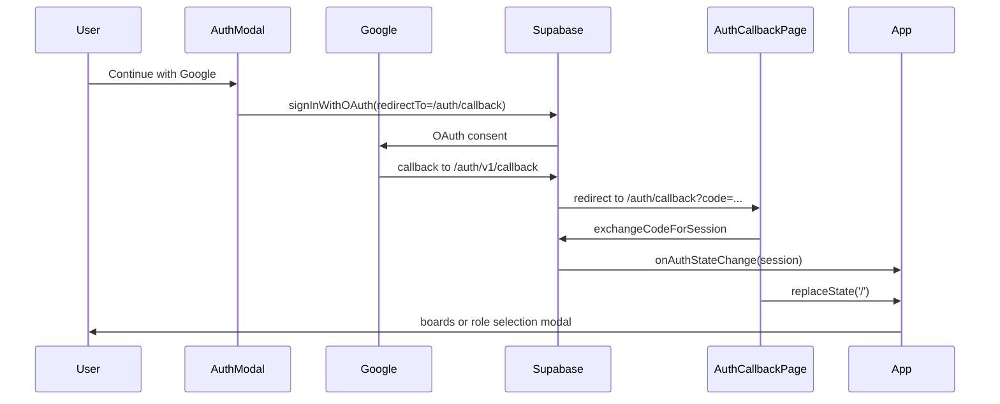
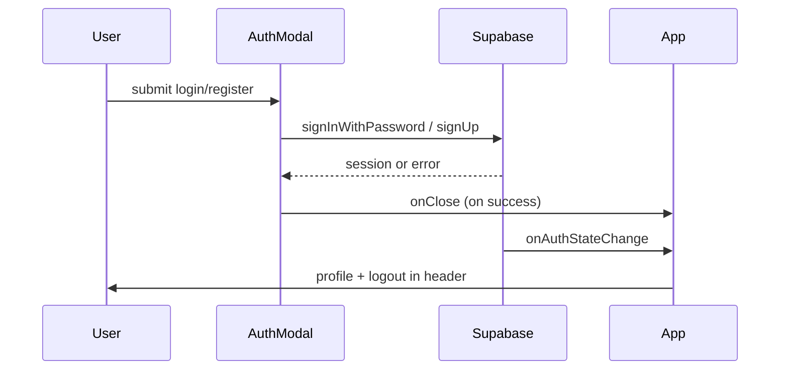

# Аутентификация (Supabase Auth)

Документация по реализованному auth-потоку во frontend.

## Обзор

- **Backend:** Supabase Auth (email + password + Google OAuth)
- **Профиль:** `name` и `role` сохраняются в `auth.users.user_metadata`; для Google роль выбирается после первого входа
- **UI:** модальное окно с вкладками «Вход» / «Регистрация», реактивный хедер по сессии

## Компоненты

### `AuthModal`

Файл: [`src/components/AuthModal.tsx`](../src/components/AuthModal.tsx)

| Вкладка | Поля | API |
|---------|------|-----|
| Вход | email, password + Google OAuth | `supabase.auth.signInWithPassword`, `supabase.auth.signInWithOAuth` |
| Регистрация | имя, email, password, подтверждение пароля, роль | `supabase.auth.signUp` |

**Роли при регистрации (IT-команда):**

- Frontend Developer
- Backend Developer
- Fullstack Developer
- QA Engineer
- DevOps Engineer
- Product Manager
- UI/UX Designer
- Data Analyst

**Metadata при signUp:**

```typescript
options: {
  data: {
    name: string,
    role: string,
  },
}
```

**Валидация на клиенте:**

- все обязательные поля заполнены
- пароль ≥ 8 символов
- пароль и подтверждение совпадают
- роль выбрана

**UI-состояния:**

- `isSubmitting` — блокировка формы и текст «Входим...» / «Создаем аккаунт...»
- `errorMessage` — ошибки Supabase или валидации
- `successMessage` — если включено подтверждение email и сессия не создана сразу

### `App` (хедер)

Файл: [`src/App.tsx`](../src/App.tsx)

| Состояние | Хедер |
|-----------|-------|
| Гость | кнопки «Войти» и «Регистрация» |
| Авторизован | профиль (имя/email + аватар-инициал) + «Выйти» |

**Отображаемое имя:**

1. `session.user.user_metadata.name` (если непустое)
2. fallback: `session.user.email`

**Сессия:**

- начальная загрузка: `supabase.auth.getSession()`
- подписка: `supabase.auth.onAuthStateChange`
- выход: `supabase.auth.signOut()`

### `RoleSelectionModal`

Файл: [`src/components/RoleSelectionModal.tsx`](../src/components/RoleSelectionModal.tsx)

- показывается только для авторизованного пользователя без `user_metadata.role`
- блокирует дальнейший сценарий до выбора роли или выхода
- сохраняет роль через `supabase.auth.updateUser`

## Supabase client

Файл: [`src/lib/supabase.ts`](../src/lib/supabase.ts)

```typescript
import { createClient } from '@supabase/supabase-js'

export const supabase = createClient(
  import.meta.env.VITE_SUPABASE_URL,
  import.meta.env.VITE_SUPABASE_PUBLISHABLE_KEY,
)
```

## Настройка окружения

Для локального запуска у нового разработчика: скопируйте `.env.example` в `.env.local` и подставьте ключи из Supabase Dashboard.

1. Скопируйте `.env.example` → `.env.local`
2. Заполните переменные из Supabase Dashboard → Settings → API:

```env
VITE_SUPABASE_URL=https://<project-ref>.supabase.co
VITE_SUPABASE_PUBLISHABLE_KEY=<publishable-or-anon-key>
```

`.env.local` не коммитится (см. `.gitignore` → `*.local`).

## Google OAuth

### Redirect URLs

**Google Cloud OAuth client (Authorized redirect URI):**

- `https://ecwsbjkxiwsoqbihsizo.supabase.co/auth/v1/callback`

**Supabase Dashboard → Authentication → URL Configuration → Redirect URLs:**

- `http://localhost:5173/auth/callback`
- `https://<your-production-domain>/auth/callback`

Frontend после OAuth возвращается на `/auth/callback`, где вызывается `exchangeCodeForSession`, затем URL очищается до `/`.

### Поток Google OAuth



## Поток данных



## Подтверждение email

Если в Supabase включено **Confirm email**, после регистрации:

- `signUp` может вернуть `session: null`
- пользователю показывается сообщение проверить почту
- вход возможен только после подтверждения

## Что не входит в текущую реализацию

- таблица `public.profiles` и RLS-политики
- восстановление пароля
- защищённые роуты / redirect после login

## Ручная проверка

1. `npm run dev`
2. **Регистрация:** заполнить форму → аккаунт в Supabase Auth, metadata с `name` и `role`
3. **Вход email/password:** в хедере имя/email и «Выйти»
4. **Вход Google:** редирект в Google → возврат на `/auth/callback` → сессия → boards (или выбор роли, если role пустая)
5. **Выход:** «Выйти» → снова «Войти» / «Регистрация»
